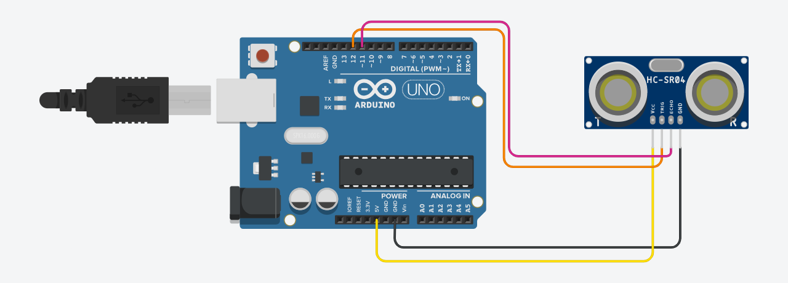
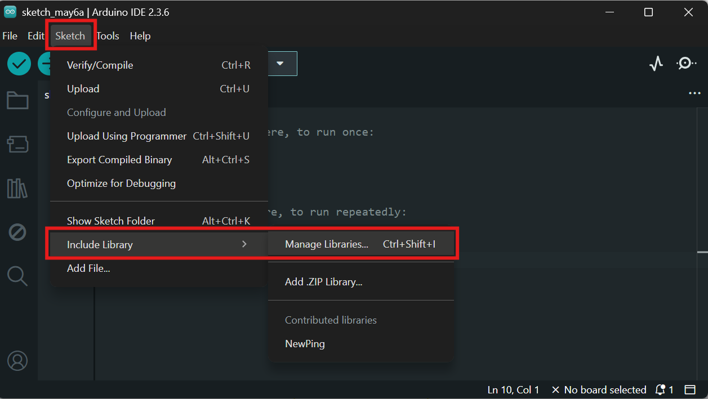
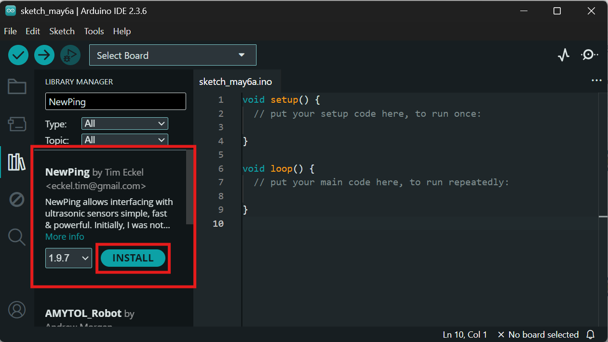
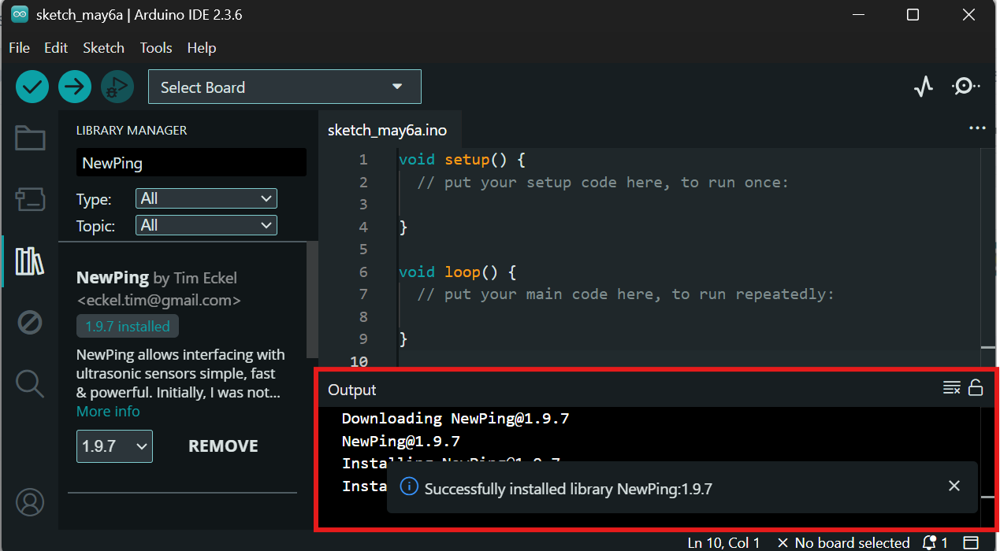

# Distance Sensor (HC-SR04) Safety Barrier

This project demonstrates how to use an **HC-SR04 ultrasonic distance sensor** in combination with an Arduino and Grasshopper to detect nearby objects. The system enables you to define a dynamic safety barrier around robotic systems—automatically pausing movement if a human enters the predefined threshold zone.


## Electronic Components



- 1 × **HC-SR04 Ultrasonic Distance Sensor**
- 1 × **Arduino UNO/Nano/Mega**
- Jumper wires
- Breadboard (optional)
- Optional: LED or Servo for visual feedback


## How to Install Arduino Library

This project uses native Arduino functions and does **not require third-party libraries**. If using `NewPing`, follow these steps:

1. Open **Arduino IDE**.  
2. Go to `Sketch > Include Library > Manage Libraries`.  


3. In the Library Manager, search for `NewPing`. Then, click **Install**.


4. Once the library is installed, you should see the notication below.  



## Uploading the Arduino Sketch

1. Connect your Arduino board via USB.
2. Open the file `ArduinoSketch_ReadingDistance.ino` in the Arduino IDE.
3. Select the correct **Board** and **Port** under `Tools`.
4. Click the **Upload** button.

Once uploaded, the Arduino will continuously measure distance and send the data via serial to your computer.

## How the System Works

The HC-SR04 emits an ultrasonic pulse and measures the time it takes to reflect off the nearest object. This time is converted into a distance value using the formula:


```
distance_cm = duration / 58.0;
```

These distance values are streamed via serial and read into **Grasshopper** using the **Firefly plugin**. In Grasshopper, you can set a distance threshold (e.g., 50 cm). If the measured value is less than this, the system can:

- Trigger a virtual stop condition
- Send a digital output to pause or disable motors
- Visualize the safety boundary breach


## Limitations of HC-SR04

While useful for simple distance sensing, the HC-SR04 has notable limitations:

- **Limited Accuracy**: Readings fluctuate with environmental noise, temperature, or soft/angled surfaces.
- **Narrow Beam**: Only detects objects within its narrow cone (±15 degrees).
- **Blind Zone**: Cannot detect objects closer than ~2 cm or farther than ~400 cm.
- **Not Industrial-Grade**: Not suitable for high-speed or precision-critical robotic safety systems.

For critical applications, consider upgrading to a **time-of-flight (ToF) sensor**, **LIDAR**, or using **redundant sensing strategies**.


## Suggested Safety Protocol

This system is intended for **educational and prototyping purposes only**. If used in live robotics, ensure:

- Proper sensor mounting for consistent direction
- Redundant emergency stop mechanisms
- Oversight by individuals with electrical and robotic safety training

