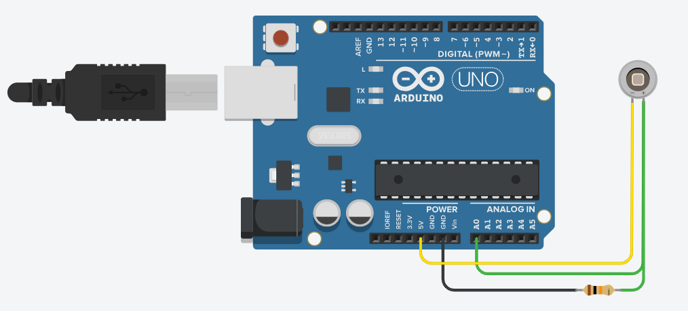

# LightLux: Ambient Light Sensing with Arduino and Grasshopper

This project demonstrates how to use a **photodiode-based light sensor** with an Arduino and **Grasshopper (Rhino)** to monitor ambient light levels. It enables real-time interaction between environmental lighting conditions and parametric design logic in Grasshopper — suitable for responsive architecture, kinetic systems, or data-driven environmental design.

## Electronic Components



- 1 × **Photodiode** (any general-purpose silicon photodiode)
- 1 × **10kΩ Resistor** (for voltage divider)
- 1 × **Arduino UNO/Nano/Mega**
- Jumper wires
- Breadboard (optional)
- Optional: Op-amp for transimpedance amplification (for precision sensing)


## Uploading the Arduino Sketch

1. Connect your Arduino board via USB.  
2. Open the file `ArduinoSketch_LightLux.ino` in the Arduino IDE.  
3. Select the correct **Board** and **Port** under `Tools`.  
4. Click the **Upload** button.

Once uploaded, the Arduino will read analog values from the photodiode circuit and send them over the serial port.

## How the System Works

A photodiode changes its behavior in response to light intensity. In this setup, it is wired in reverse-bias mode, forming a **voltage divider** with a resistor. The Arduino reads the resulting voltage using `analogRead()`, producing a value between:

```
lightLevel = 0 (dark) to 1023 (bright)
```

## Limitations of Photodiode Sensing

While fast and responsive, photodiodes come with some limitations:

- **Nonlinear Response**: Output is not linearly proportional to lux. Calibration is required.
- **Low Voltage**: Without an op-amp, output voltage may be too low under dim conditions.
- **Ambient Noise Sensitivity**: Electrical interference can affect analog reads.
- **Directional Bias**: Photodiodes are directional and sensitive to sensor orientation.

For high-precision measurements, consider using a photodiode with a **transimpedance amplifier** or upgrading to a **lux-calibrated sensor** (e.g., TSL2561, BH1750).

## Suggested Calibration Procedure

1. Use a lux meter (or smartphone app) to capture known light levels in your test environment.
2. Record corresponding Arduino `analogRead()` values.
3. Fit a curve (linear, exponential, or logarithmic) to map raw values to real-world lux.

## Safety and Experimental Use

This system is designed for **educational and prototyping purposes**. If integrating into built systems:

- Shield photodiodes from environmental noise
- Use power regulation if running Arduino off external sources
- Validate data ranges and scaling in Grasshopper before use in feedback loops
