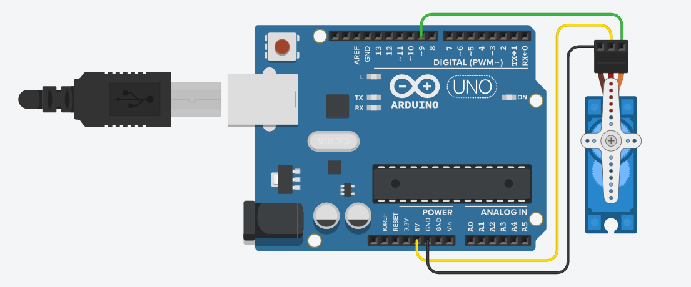

# ServoGripperControl: Interfacing a Servo Motor with Grasshopper for a 3D-Printed Gripper

This project demonstrates how to control a **servo motor** from **Grasshopper (Rhino)** using the **Firefly plugin** and an Arduino. The servo actuates a **3D-printed gripper mechanism**, enabling real-time interactive physical behavior driven by parametric inputs.

## Electronic Components



- 1 × **Micro Servo Motor** (e.g., SG90 or MG90S)
- 1 × **Arduino UNO or Mega** (verified)
- Jumper wires
- Optional: External 5V power supply (recommended for stable performance)
- 1 × [3D Printed Gripper](https://www.thingiverse.com/thing:2985850)

## Uploading the Arduino Firmware

1. Connect the Arduino via USB.
2. Open the Arduino IDE.
3. Open the `ArduinoSketch_Firmata`.
4. Under `Tools`, select your **Board** (UNO/Mega) and **Port**.
5. Click **Upload**.

This installs the protocol, enabling communication between Grasshopper and the servo via Firefly.

## How the System Works

In Grasshopper:

- A **slider component** sends a value (0–180) to represent the servo's rotation angle.
- Firefly transmits this value to the Arduino using serial communication.
- The servo rotates accordingly, controlling the opening and closing of the 3D-printed gripper.

### Typical Wiring:

```
Servo Signal → D9 (PWM pin)
Servo Power  → +5V
Servo GND    → GND
```

> 🔌 For best performance and to avoid power issues, use an **external 5V source** if running more than one servo or applying mechanical load.


