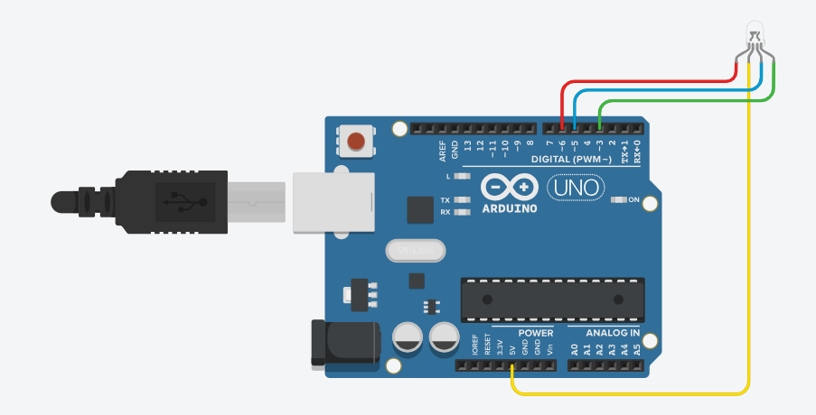

# RGBLightControl: Controlling a 5V RGB LED Strip via Grasshopper and Arduino

This project enables real-time control of a **5V RGB LED light strip** using interactive components in **Grasshopper (Rhino)**. The system bridges parametric design environments with physical lighting control, making it ideal for prototyping ambient interfaces, responsive installations, or lighting studies.

## Electronic Components

Refer to the included schematic file for full wiring details.



- 1 × **5V RGB LED Strip (common anode with built-in resistors)**
- 1 × **Arduino UNO or Mega** (verified)
- Jumper wires
- Optional:
  - **N-channel MOSFETs or BJTs** (recommended for longer strips or high brightness)
  - **Resistors (220–330Ω)** for gate/base control if using transistors
  - **External 5V power supply** for higher current demands

> ⚠️ The LED strip used in this project includes **built-in current-limiting resistors**, so no external series resistors are required for each color channel.

## Uploading the Arduino Firmware

Before communicating with Grasshopper, upload the **Firmata firmware** to your Arduino.

1. Open the Arduino IDE.
2. Navigate to `File` → `Examples` → `Firmata` → `StandardFirmata`.
3. Under `Tools`, select your **Board** (UNO or Mega) and **Port**.
4. Click **Upload**.

Once uploaded, the Arduino will be able to receive RGB values from Grasshopper over the serial connection.

## How the System Works

Within Grasshopper, a **button component** (in the green group) or similar UI element triggers RGB color updates. These values are transmitted via **Firefly**, **Heteroduino**, or a compatible serial plugin. The Arduino receives the RGB values (0–255) and generates corresponding **PWM signals** on each color channel.

Color channel mapping:

```
Blue  → D3  
Red   → D5  
Green → D6
```

Each PWM signal modulates brightness for its respective LED color.

## Technical Notes on LED Strip Compatibility

The strip used in this project is a **5V RGB LED strip with a common anode (+5V) and built-in resistors**:

- The **+5V line** connects to Arduino **5V** (or an external 5V source).
- The **R, G, B lines** connect to **Arduino PWM pins** (D5, D6, D3).
- **PWM LOW** (0V) sinks current to turn the LEDs on; **PWM HIGH** (5V) turns them off.
- Built-in resistors make it safe to control **short strip segments** directly from Arduino pins for prototyping.
- For **longer segments**, use **MOSFETs** to handle higher current without risking damage to the Arduino.

> 🔌 Always verify current draw. If the total current exceeds ~150 mA, power the strip using an **external 5V power supply** and use **transistors** to switch the channels.

## Limitations and Considerations

- **PWM Resolution**: Arduino uses 8-bit PWM (0–255). For finer control, consider modifying timers or using a higher-resolution platform.
- **Color Calibration**: Different LED colors may have varying brightness levels. Optional software scaling may improve color balance.
- **Current Limits**: Each Arduino I/O pin is rated for ~20–40 mA. For long-term use, MOSFETs are strongly recommended even with built-in resistors.
- **Serial Port Conflict**: Only one application can access the Arduino’s serial port at a time — ensure the Arduino Serial Monitor is closed when using Grasshopper.

## Safety and Experimental Use

This system is intended for **educational and prototyping purposes**. For production or long-term installations:

- Use **MOSFETs** or **transistors** to switch power safely.
- **Fuse** your power supply and ensure wiring is rated for your current draw.
- Always double-check connections before powering the system.
- Secure wiring mechanically if using in a moving or public-facing installation.
